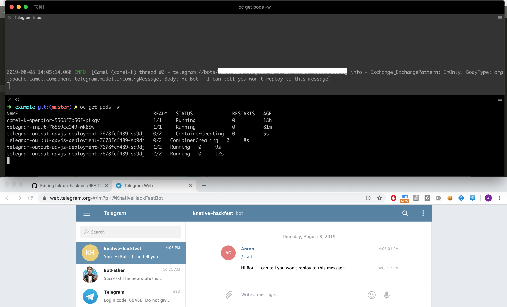
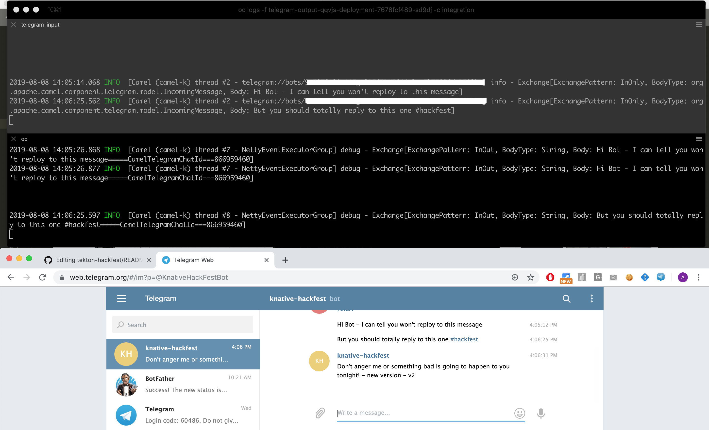

# telegram-quickstart-camelk-knative
A quickstart to create a telegram bot based on apache camel + camel-k + knative.

knative is used specifically to demonstrate autoscaling.

- Prerequisites:
  - Working OCP 4.1 cluster with sufficient privileges

- Instructions
   - Open the OpenShift console and install following operators from the OperatorHub:
     - knative-eventing-operator
     - knative-serving-operator
     - knative-camel-operator
   - Create a new namespace for telegram application
     - `oc create camelk-telegram`
   - Create a knative channel which we will use later for exchanging messages between routes
     - `oc create -f src/main/resources/telegram-input-channel.yaml`
   - Download camel-k binary client (this demo was tested with 1.0.0-M1) available in the [camel repository](https://github.com/apache/camel-k/releases) and add it to your `PATH`
   - Create a new telegram bot by following [these instructions](https://web.telegram.org/#/im?p=@BotFather) make sure to write down the Telegram API Key - we will need it later
   - Install the camel-k operatator in the `camelk-telegram` namespace
     - `kamel install`
     - You can verify the successful installation by confirming that the operator pod is up and running:
``` 
        $ oc get pods
        NAME                                READY   STATUS    RESTARTS   AGE
        camel-k-operator-5568f7d56f-ptkgv   1/1     Running   0          18h
```
   - We can now deploy the first camel route, which listen to bot messages, logs them to `stdout` and resend them to out previously created knative channel
      - There seems to be a bug which causes headers to be lost once the message is received in knative channel, therefore we are manually appending the `CamelTelegramChatId` header to the body, which is preserved (nasty, but it works!)
      - `kamel run src/main/java/com/example/TelegramInput.java -e TELEGRAM_API_KEY=<YOUR_API_KEY>`
      - Behind the scene, the code is compiled, augmented, build via s2i, deployed to internal OCP container registry and deployed onto your OCP cluster. No further config is needed. It just works.
   - We can now deploy the second camel route which listen to messages sent to knative channel, and if they contain `hackfest` it will reply back to you
      - `kamel run src/main/java/com/example/TelegramOutput.java -e TELEGRAM_API_KEY=<YOUR_API_KEY>`
      - Since this route listen on knative channel (`knative:channel/telegram-input`) it's automatically recognized by Camel Operator as Knative service and deployed as such:
```
      $ oc get kservice
      NAME              URL                                                                                       LATESTCREATED           LATESTREADY             READY   REASON
      telegram-output   http://telegram-output.camelk-test.apps.cluster-brq-c3a4.brq-c3a4.openshiftworkshop.com   telegram-output-qqvjs   telegram-output-qqvjs   True
```

   - This also means that the support for autoscaling is enabled by default. If you won't send any messages to this bot for more than 90s (default config) then the `telegram-output` service will scale down to 0.
    
  Let's test our work!
  
  In following image we can see that our bot automatically scales up as soon as we send a message:
  


In this, we see bot reply because we included `hackfest` string


